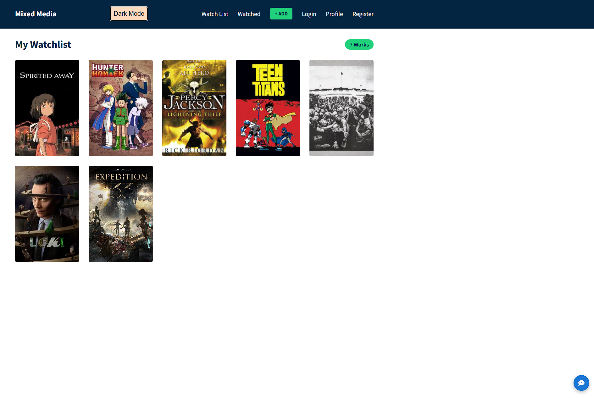
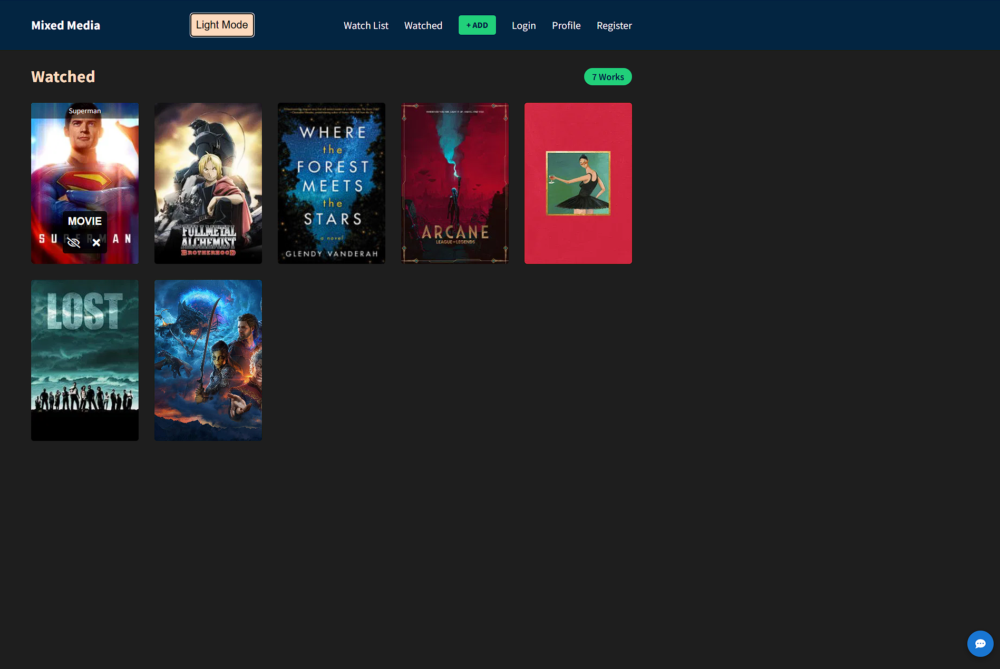
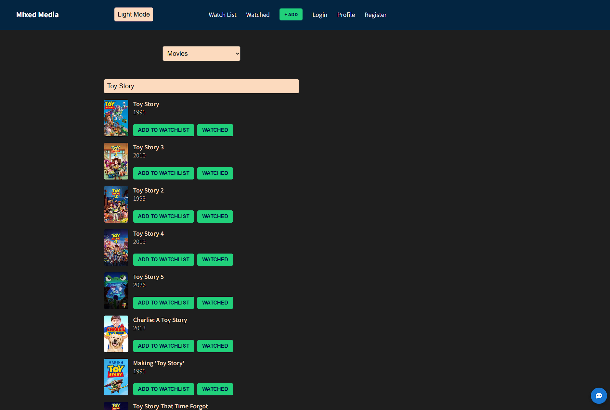
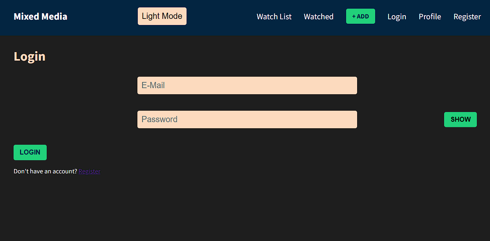
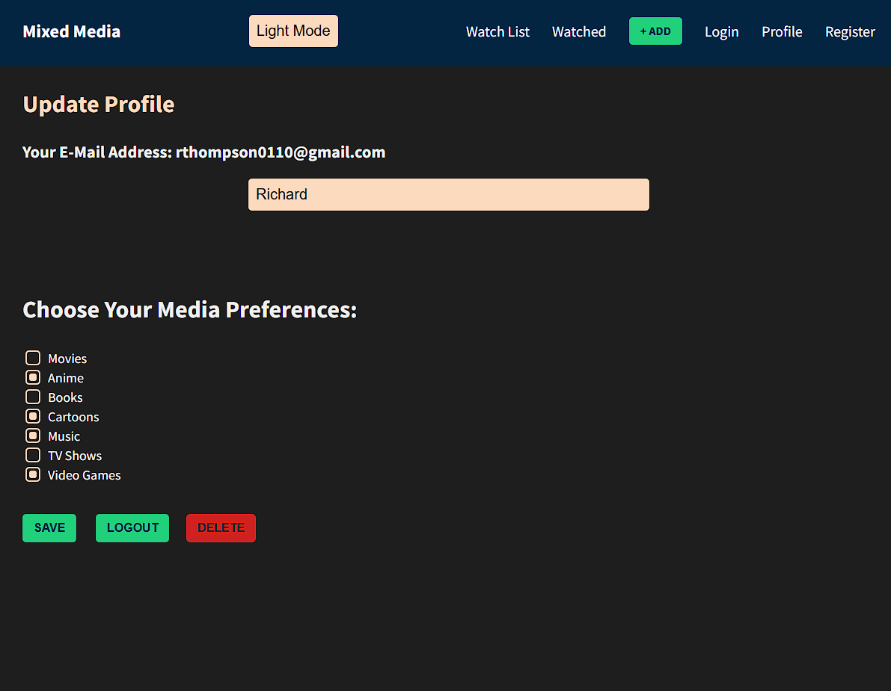
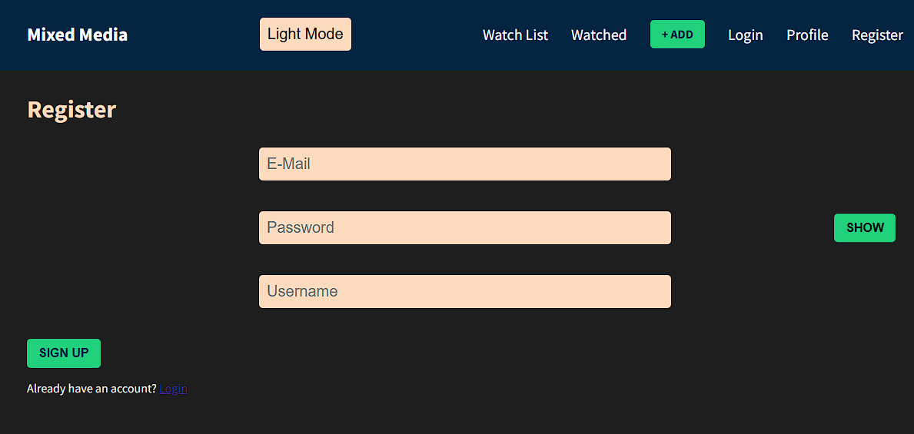

# Wish-Watch — A Mixed Media Tracker

Wish-Watch is a personal media-tracking app that lets users keep lists of what they want to watch or play across multiple formats.

Click on posters to be taken to clone website to either learn more about the movie/show, listen to the songs, or buy the product.

Users can log in, manage watchlists, manage profiles, and search for movies, tv shows, games, etc. using several different APIs.

Ask the AI Chatbot for recommendations.

This project is built with React and uses Supabase for authentication + user data.

## Features

🔐 User Authentication (Sign Up, Login, Profile) via Supabase

🛡️ Protected routes for authenticated users (Profile Page)

🔍 Media Search via TMDB, RAWG API, Google Books, and Last.fm

🎞️ Media Search via TMDB, RAWG API, Google Books, and Last.fm

📦 Watchlist & Watched Lists stored per user

⚡ Links to Fully Functioning Clone Websites

🌙 Dark Mode with Local Storage persistence

📱 Fully responsive layout

🤖 AI Chatbot

## Tech Stack

Frontend:

• React 19

• React Router DOM 7

• React Icons

Backend:

• Supabase (Auth + Database)

APIs:

• The Movie Database (TMDB)

• Google Books

• Last.fm (Music Search)

• RAWG API (Game Search)

• Open Router (AI)

Build Tools:

• Create React App

• dotenv

## Important

Account creation is required.

Page refresh is required after adding anything to either list.

## Project Structure

```
src/
├── ai/
│ ├── openrouter.js
│
├── auth/
│ ├── Login.js
│ ├── Profile.js
│ ├── Register.js
│
├── chatbot/
│ ├── Chatbot.css
│ ├── Chatbot.js
│
├── components/
│ ├── Add.js
│ ├── Header.js
│ ├── MovieCard.js
│ ├── MovieControls.js
│ ├── ProtectedRoute.js
│ ├── ResultCard.js
│ ├── Watched.js
│ ├── Watchlist.js
│
├── context/
│ ├── AppReducer.js
│ ├── AuthContext.js
│ ├── GlobalState.js
│
├── supabase/
│ ├── supabaseClient.js
│
├── App.css
├── App.js
├── AuthProvider.js
├── index.js
├── reportWebVitals.css
```

## Screenshots

### Watchlist Page



### Watched Page



### Add Page



### Login Page



### Profile Page



### Register Page


